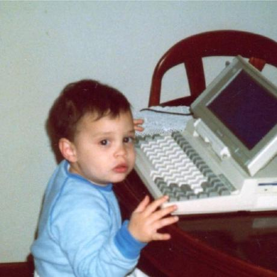

|  | That's me ⮧ |
|---|---|
| I'm a software developer from Portugal. Currently living in the UK. I work as a senior/lead dev at [Panintelligence](https://panintelligence.com), where I get to play with data and mentor our juniors. Online, I use '**Dosaki**' as my monicker. Building things is my passion and I've been doing it for quite some time. I run the python and javascript sessions for my local Code Club to help kids learn how to program and I mentor a promising group at a [CoderDojo](). You'll find I talk mostly about tech, video, board games... and containers. I talk a lot about containers. |  |
