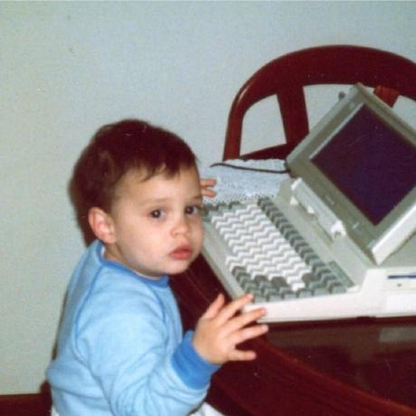

|  | That's me ⮧ |
|---|---|
| I'm a software developer from Portugal. Currently living in the UK. I'm the Head of Technology at [The Keyholding Company](https://keyholding.com) and previously Software Development Manager for [Panintelligence](https://panintelligence.com). Online, I use '**Dosaki**' as my monicker. Building things is my passion and I've been doing it for quite some time. I run the python and javascript sessions for my local Code Club to help kids learn how to program and I mentor a promising group at my local CoderDojo. You'll find I talk mostly about tech, videogames and board games |  |
